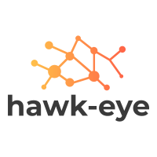

    

hawk-eye is a continuous integration status reporter built to watch over the Github CI statuses

:construction: This is just  a proof of concept, but still not fully stable. Expect dragons and unfinished business. :construction:

## Contribute
PRs accepted.

git clone git@github.com:sladyn98/hawk-eye.git
You can now run `make` to build the project, or `make install` to install the binary in $GOPATH/bin/.
To work on the web UI, have a look at the dedicated Readme.
